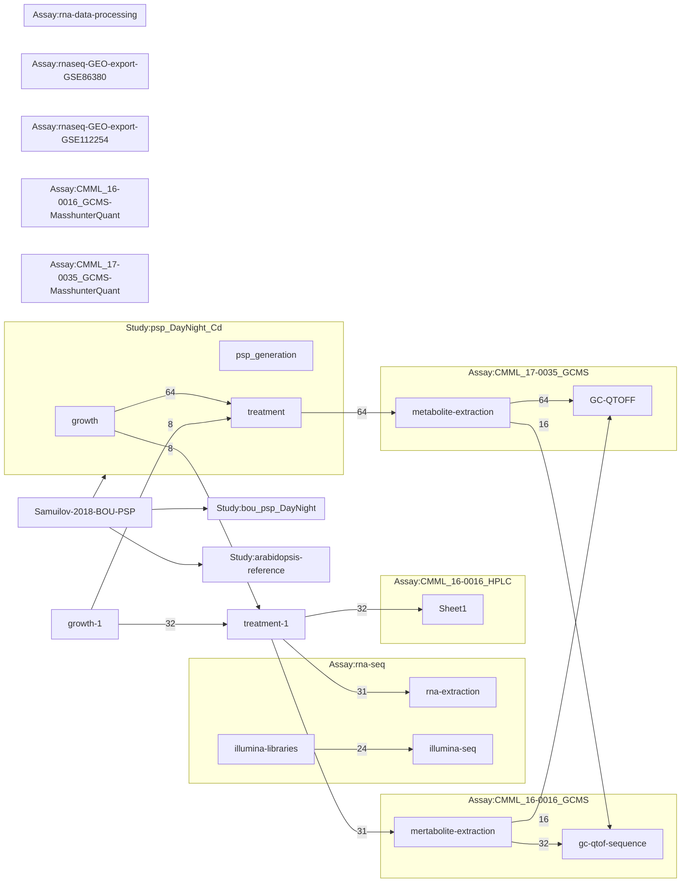

```mermaid
flowchart LR
    Samuilov-2018-BOU-PSP[Samuilov-2018-BOU-PSP]
    Samuilov-2018-BOU-PSP-->Study:psp_DayNight_Cd
    subgraph Study:psp_DayNight_Cd
        psp_generation[psp_generation]
        growth[growth]
        treatment[treatment]
    end
    Samuilov-2018-BOU-PSP-->Study:arabidopsis-reference
    subgraph Study:arabidopsis-reference
    end
    Samuilov-2018-BOU-PSP-->Study:bou_psp_DayNight
    subgraph Study:bou_psp_DayNight
        growth[growth]
        treatment[treatment]
    end
    subgraph Assay:CMML_17-0035_GCMS-MasshunterQuant
    end
    subgraph Assay:CMML_16-0016_GCMS
        mertabolite-extraction[mertabolite-extraction]
        gc-qtof-sequence[gc-qtof-sequence]
    end
    subgraph Assay:CMML_16-0016_GCMS-MasshunterQuant
    end
    subgraph Assay:rna-seq
        rna-extraction[rna-extraction]
        illumina-libraries[illumina-libraries]
        illumina-seq[illumina-seq]
    end
    subgraph Assay:rnaseq-GEO-export-GSE112254
    end
    subgraph Assay:CMML_16-0016_HPLC
        Sheet1[Sheet1]
    end
    subgraph Assay:rnaseq-GEO-export-GSE86380
    end
    subgraph Assay:CMML_17-0035_GCMS
        metabolite-extraction[metabolite-extraction]
        GC-QTOFF[GC-QTOFF]
    end
    subgraph Assay:rna-data-processing
    end
    growth-->|64|treatment
    growth-->|8|treatment-1
    treatment-->|64|metabolite-extraction
    growth-1-->|8|treatment
    growth-1-->|32|treatment-1
    treatment-1-->|31|mertabolite-extraction
    treatment-1-->|31|rna-extraction
    treatment-1-->|32|Sheet1
    mertabolite-extraction-->|32|gc-qtof-sequence
    mertabolite-extraction-->|16|GC-QTOFF
    illumina-libraries-->|24|illumina-seq
    metabolite-extraction-->|16|gc-qtof-sequence
    metabolite-extraction-->|64|GC-QTOFF

```
