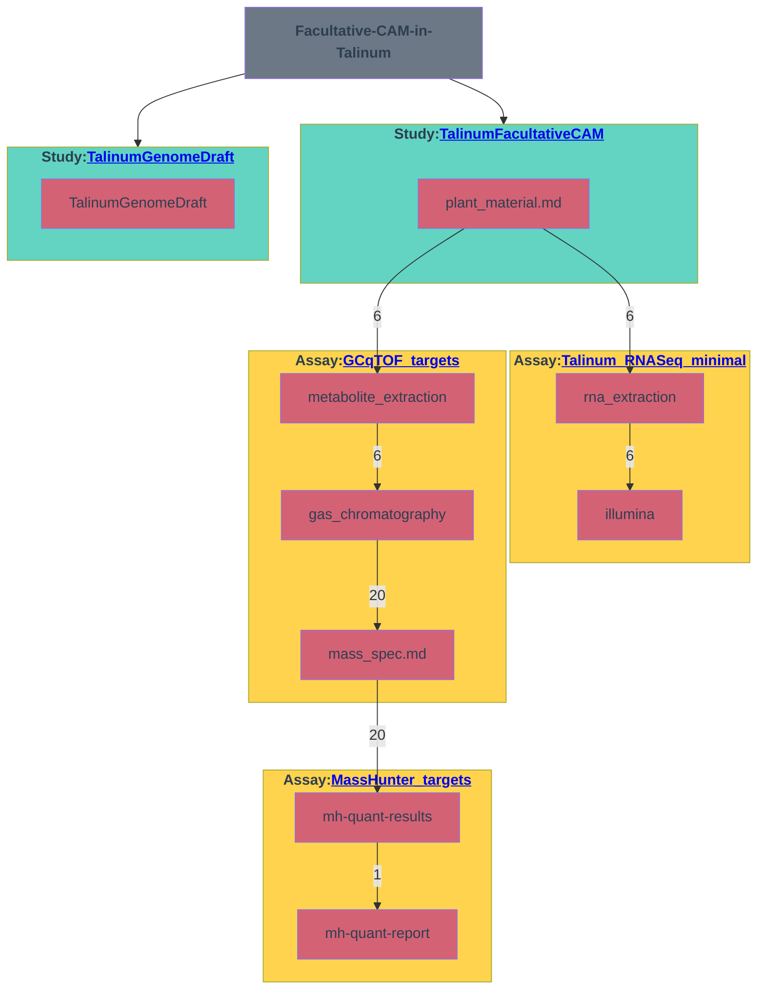

```mermaid
flowchart TD
    Facultative-CAM-in-Talinum[Facultative-CAM-in-Talinum]
    Facultative-CAM-in-Talinum-->STUDY_TalinumFacultativeCAM
    subgraph STUDY_TalinumFacultativeCAM[Study:<a href='./studies/TalinumFacultativeCAM'>TalinumFacultativeCAM</a>]
        plant_material.md[plant_material.md]
    end
    Facultative-CAM-in-Talinum-->STUDY_TalinumGenomeDraft
    subgraph STUDY_TalinumGenomeDraft[Study:<a href='./studies/TalinumGenomeDraft'>TalinumGenomeDraft</a>]
        TalinumGenomeDraft[TalinumGenomeDraft]
    end
    subgraph ASSAY_Talinum_RNASeq_minimal[Assay:<a href='./assays/Talinum_RNASeq_minimal'>Talinum_RNASeq_minimal</a>]
        rna_extraction[rna_extraction]
        illumina[illumina]
    end
    subgraph ASSAY_GCqTOF_targets[Assay:<a href='./assays/GCqTOF_targets'>GCqTOF_targets</a>]
        metabolite_extraction[metabolite_extraction]
        gas_chromatography[gas_chromatography]
        mass_spec.md[mass_spec.md]
    end
    subgraph ASSAY_MassHunter_targets[Assay:<a href='./assays/MassHunter_targets'>MassHunter_targets</a>]
        mh-quant-results[mh-quant-results]
        mh-quant-report[mh-quant-report]
    end
    plant_material.md-->|6|rna_extraction
    plant_material.md-->|6|metabolite_extraction
    rna_extraction-->|6|illumina
    metabolite_extraction-->|6|gas_chromatography
    gas_chromatography-->|20|mass_spec.md
    mass_spec.md-->|20|mh-quant-results
    mh-quant-results-->|1|mh-quant-report

classDef inv fill:#6c7885,color:#2d3e50,font-weight:bold;
classDef study fill:#62d4c1,color:#2d3e50,font-weight:bold;
classDef assay fill:#ffd34d,color:#2d3e50,font-weight:bold;
classDef process fill:#D46275,color:#2d3e50,font-weight:;
class Facultative-CAM-in-Talinum inv;
class STUDY_TalinumFacultativeCAM,STUDY_TalinumGenomeDraft study;
class ASSAY_Talinum_RNASeq_minimal,ASSAY_GCqTOF_targets,ASSAY_MassHunter_targets assay;
class plant_material.md,TalinumGenomeDraft,rna_extraction,illumina,metabolite_extraction,gas_chromatography,mass_spec.md,mh-quant-results,mh-quant-report process;
```
