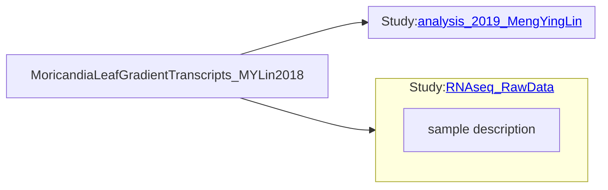

```mermaid
flowchart LR
    MoricandiaLeafGradientTranscripts_MYLin2018[MoricandiaLeafGradientTranscripts_MYLin2018]
    MoricandiaLeafGradientTranscripts_MYLin2018-->RNAseq_RawData
    subgraph RNAseq_RawData[Study:<a href='./studies/RNAseq_RawData'>RNAseq_RawData</a>]
        sample-description[sample description]
    end
    MoricandiaLeafGradientTranscripts_MYLin2018-->analysis_2019_MengYingLin
    subgraph analysis_2019_MengYingLin[Study:<a href='./studies/analysis_2019_MengYingLin'>analysis_2019_MengYingLin</a>]
    end
    subgraph RNAseq_RawData[Assay:<a href='./studies/RNAseq_RawData'>RNAseq_RawData</a>]
    end

```
