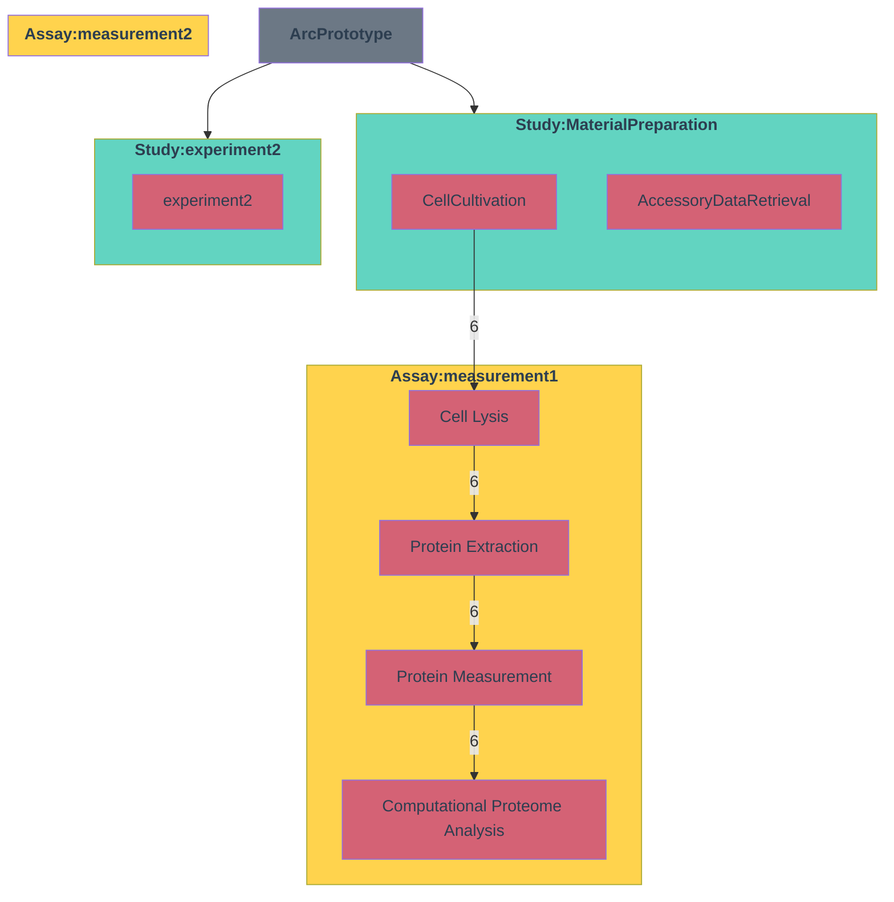

```mermaid
flowchart TD
    ArcPrototype[ArcPrototype]
    ArcPrototype-->STUDY_MaterialPreparation
    subgraph STUDY_MaterialPreparation[Study:MaterialPreparation]
        CellCultivation[CellCultivation]
        AccessoryDataRetrieval[AccessoryDataRetrieval]
    end
    ArcPrototype-->STUDY_experiment2
    subgraph STUDY_experiment2[Study:experiment2]
        experiment2[experiment2]
    end
    subgraph ASSAY_measurement1[Assay:measurement1]
        Cell-Lysis[Cell Lysis]
        Protein-Extraction[Protein Extraction]
        Protein-Measurement[Protein Measurement]
        Computational-Proteome-Analysis[Computational Proteome Analysis]
    end
    subgraph ASSAY_measurement2[Assay:measurement2]
    end
    CellCultivation-->|6|Cell-Lysis
    Cell-Lysis-->|6|Protein-Extraction
    Protein-Extraction-->|6|Protein-Measurement
    Protein-Measurement-->|6|Computational-Proteome-Analysis

classDef inv fill:#6c7885,color:#2d3e50,font-weight:bold;
classDef study fill:#62d4c1,color:#2d3e50,font-weight:bold;
classDef assay fill:#ffd34d,color:#2d3e50,font-weight:bold;
classDef process fill:#D46275,color:#2d3e50,font-weight:;
class ArcPrototype inv;
class STUDY_MaterialPreparation,STUDY_experiment2 study;
class ASSAY_measurement1,ASSAY_measurement2 assay;
class CellCultivation,AccessoryDataRetrieval,experiment2,Cell-Lysis,Protein-Extraction,Protein-Measurement,Computational-Proteome-Analysis process;
```
